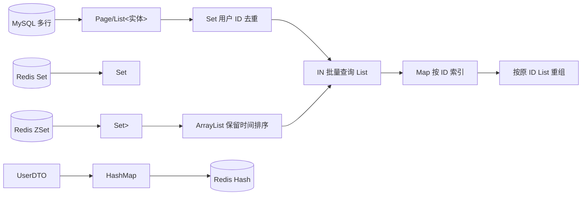

# 黑马点评 Java 容器使用地图

> 扫描范围：`src/main/java` 下全部 Java 源文件（不含 `target`）。扫描日期：2026-07-17。本文说的“容器”既包括 Java 集合框架，也包括本项目实际承接多条数据的 `Page<T>`、数组，以及 Redis 映射到 Java 的 `Set`/`Map`。
>
> 阅读方法：先读“总图”和“选型规则”，再按业务读第 4 节。`List<User>` 中尖括号里的 `User` 是**元素类型**；变量完整类型是 `List<User>`，不是只有 `List`。

## 1. 先建立全局认识



这个项目的容器不是“为了用集合而用集合”。最重要的三种目的如下：

| 目的 | 项目中的代表 | 选型关键词 |
|---|---|---|
| 返回/遍历多条数据 | `List<Blog>`、`List<Voucher>` | 有顺序、允许重复、可按下标 |
| 去重或集合运算 | `Set<Long>`、Redis Set | 不重复、交集 |
| 按 ID 快速回填 | `Map<Long, User>`、`Map<Long, Blog>` | key → value，平均 O(1) 查找 |

### 本次扫描的结论

- 实际使用：`List`、`ArrayList`、`Set`、`Map`、`HashMap`、`Collections.emptyList()`、`Collectors.toList/toSet/toMap`、`Stream` 操作、`Object[]`、MyBatis-Plus `Page<T>`。
- **未发现实际使用**：`HashSet`、`Queue`、`Deque`、`PriorityQueue`、`ConcurrentHashMap`、`Arrays`、`java.util.stream.Stream` 类型变量、`Collector`（单数）或 `Collectors.groupingBy`。
- `BlogController` 的 `List`/`Page` 导入、`LoginInterceptor` 的 `Map` 导入是未使用导入；`ShopTypeController` 的 `List<ShopType>` 只出现在注释示例，均不构成运行时容器逻辑。
- `Set` 的具体实现大多由 Redis/Spring 或 `Collectors.toSet()` 决定，源码没有直接 `new HashSet<>()`。所以**不要因为变量写成 `Set` 就假设它有稳定迭代顺序**。

## 2. 容器速查与选型规则

| 容器 | 本项目如何使用 | 顺序 | 去重 | 按 key 查找 | 学习等级 |
|---|---|---:|---:|---:|---|
| `List<E>` | 数据库多行结果、接口返回、待回填的 ID 序列 | 是 | 否 | 否 | 【必须会写】 |
| `ArrayList<E>` | Feed 中手动追加 Redis 返回的博客 ID | 是 | 否 | 否 | 【必须会写】 |
| `Set<E>` | 用户 ID 去重、Redis ZSet/Set 返回 | 接口不保证 | 是 | 否 | 【必须理解】 |
| `Map<K,V>` | 用户/博客 ID 建索引、Redis Hash 字段 | 无业务排序要求 | key 唯一 | 是 | 【必须会写】 |
| `HashMap<K,V>` | 将 `UserDTO` 转为 Redis Hash 字段集合 | 不保证 | key 唯一 | 是 | 【必须会写】 |
| `Object[]` | 将多个博客 ID 作为 Redis ZSet `remove` 的可变参数 | 有下标 | 否 | 否 | 【必须理解】 |
| `Collections.emptyList()` | 没有结果时返回不可变空列表 | 空 | — | — | 【面试必背】 |
| `Page<E>`（第三方） | 同时装分页元数据和当前页 `List<E>` | 当前页有序 | 否 | 否 | 【必须理解】 |

**项目选型口诀：**

1. “查出很多行、要展示或顺序处理”用 `List<E>`。
2. “只关心有没有、不能重复、求交集”用 `Set<E>`/Redis Set。
3. “拿一个 ID 立即拿对象”用 `Map<ID, Entity>`，但别把它当有序列表。
4. “数据库的 `IN (...)` 查回来的顺序不能代表输入顺序”时，用 `List<ID> + Map<ID,Entity> + List` 重组。
5. “没有结果”优先返回空集合，不要用 `null`；调用方就能安全 `for`/`stream`。
6. 普通 `HashMap`/`HashSet` 不是线程安全容器；本项目没有共享内存并发容器需求。真有跨线程共享且大量读写才评估 `ConcurrentHashMap`，不要机械替换。

## 3. 全量位置索引

下面“顺序”说的是**业务是否依赖迭代顺序**，不是某个运行时实现碰巧能否迭代出固定顺序。

### 3.1 `List` / `Page`：数据库多行结果和响应载体

| 文件：类：方法（行） | 完整类型；内容 | 为什么用它 / 语义 | 顺序、去重、key 查询；可替换性 |
|---|---|---|---|
| `dto/Result.java`：`Result.ok`（24） | 参数 `List<?> data`；任意列表响应 | 给“列表 + total”统一封装 | 元素类型被 `?` 隐藏，`Result` 又把它存为 `Object`，灵活但弱类型。可做泛型 `Result<T>`，但会影响全项目 API。|
| `dto/ScrollResult.java`：字段（12） | `List<?> list`；滚动分页当前页 | 既能承接 `List<Blog>`，也能承接其他列表 | 当前使用处装的是博客；`?` 防止向其中乱 add，却丢失读取时的元素类型。|
| `mapper/ShopTypeMapper.java`：`selectAllBySort`（19）、`search`（25） | 返回 `List<ShopType>`；多条店铺分类 | SQL 多行天然对应列表 | `selectAllBySort` 名称表示业务依赖排序；`search` 若需排序应由 SQL `ORDER BY` 明示。不能改成 Set，否则返回顺序与重复语义改变。|
| `mapper/VoucherMapper.java`：`queryVoucherOfShop`（19） | `List<Voucher>`；一个商铺的多张券 | 一对多查询 | 展示通常依赖 SQL 顺序；若无 `ORDER BY`，数据库顺序也不应作为契约。|
| `service/impl/ShopTypeServiceImpl.java`：`queryTypeList`（57） | `List<ShopType> typeList`；分类 | `.orderByAsc("sort").list()` 得到多行 | **依赖 sort 顺序**，不去重、不按 key 查。用 Set 会破坏菜单顺序。|
| `service/impl/VoucherServiceImpl.java`：`queryVoucherOfShop`（33） | `List<Voucher> vouchers`；商铺券 | Mapper 多行结果直接透传 | 若前端要稳定展示，应在 SQL 中定义排序。|
| `controller/ShopController.java`：`queryShopByType`（68）、`queryShopByName`（87） | `Page<Shop> page`，`page.getRecords()` 为 `List<Shop>` | `Page` 保存页码、大小、记录列表；返回当前页商铺 | 当前页记录顺序由查询条件/SQL 决定。`Page` 不是 JavaSE `List`，但它的 `getRecords()` 是列表。|
| `service/impl/BlogServiceImpl.java`：`queryHotBlog`（58/65） | `Page<Blog>`、`List<Blog> blogs`；热门博客页 | 排序后查询多条博客，再批量填充作者 | 依赖 `liked desc, id desc`；不能用 Set。|
| 同上：`queryMyBlog`（95/103） | `Page<Blog>`、`List<Blog> blogs`；我的博客页 | 分页 + 批量作者回填 | 依赖 `create_time desc, id desc`。|
| 同上：`queryBlogByUserId`（115/123） | `Page<Blog>`、`List<Blog> blogs`；某作者博客页 | 同上 | 依赖时间顺序。|
| 同上：`saveBlog`（170） | `List<Follow> fans`；当前作者的所有粉丝关系 | 查多行后逐个写入 Feed | 不依赖粉丝迭代顺序，不去重；列表适配 ORM 返回。数量大时这是 fan-out 写放大，见第 6 节。|
| 同上：`queryBlogLikes`（263/266/273） | `List<Long> userIds`、`List<User> users`、`List<UserDTO> result` | 点赞 ID 序列、批量查用户、再按点赞顺序输出 DTO | `userIds`/`result` 需要顺序；`users` 不可信任 DB 返回顺序。|
| 同上：`fillBlogUsers`（301/315） | 参数 `List<Blog> blogs`、`List<User> users` | 多个博客批量补作者 | blogs 的列表顺序必须保持；用户列表本身不需要顺序。|
| 同上：`queryBlogOfFollow`（411/452/462） | `ArrayList<Long> blogIds`、`List<Blog> queriedBlogs`、`List<Blog> blogs` | Redis 时间排序 ID、批查、保序重组 | 此处顺序至关重要；`ArrayList` 支持按添加顺序和预分配容量。|
| `service/impl/FollowServiceImpl.java`：`followCommons`（191/194/196） | `List<Long> userIds`、`List<User> users`、`List<UserDTO> result` | 共同关注 ID → 批查用户 → DTO | Set 交集本身无序，当前结果**没有声明排序契约**。若 UI 要排序，应重组或 SQL `ORDER BY`。|
| 同上：`seedHistoricalBlogs`（210） | `Page<Blog> page`，`page.getRecords()` 为 `List<Blog>` | 只取新关注博主最近 20 篇 | 明确按创建时间、ID 降序，遍历时写 Redis ZSet。|
| 同上：`removeBlogsAfterUnfollow`（243） | `List<Blog> blogs`；被取关作者的博客 | SQL 只查 ID，随后批量删除 Feed 成员 | 不依赖顺序；这里本可直接查 `List<Long>`，可减少 Blog 对象创建。|

补充：`controller/ShopTypeController.java` 的 `List<ShopType>` 只在注释；`controller/BlogController.java` 的 `List` 导入未使用，二者不是有效逻辑。

### 3.2 `Set`：去重、交集，以及 Redis 返回值

| 文件：类：方法（行） | 完整类型；内容 | 为什么用它 | 顺序、去重、key 查询；可替换性 |
|---|---|---|---|
| `BlogServiceImpl`：`queryBlogLikes`（256） | `Set<String> top5UserIds`；Redis ZSet 的前 5 个用户 ID 字符串 | Spring `reverseRange` API 返回 Set；同一用户不能在同一点赞 ZSet 中重复 | Redis ZSet 按 score 取出，但 Java 变量声明成 `Set`，接口不承诺迭代顺序。业务希望“最近点赞优先”，要特别警惕这一点；不能换为普通 HashSet。|
| `BlogServiceImpl`：`fillBlogUsers`（306） | `Set<Long> userIds`；当前页博客的作者 ID | 多篇博客可能同作者，先去重后一个 `IN` 批查，避免重复 ID | 不依赖顺序、需要去重、不按 key 查。此处若 List 不去重，数据库结果多数仍正确，但 IN 参数冗余。|
| `BlogServiceImpl`：`queryBlogOfFollow`（391） | `Set<ZSetOperations.TypedTuple<String>> tuples`；每项是 `(blogId 字符串, score 时间戳)` | Redis ZSet 带分数范围查询的原始返回类型 | Redis 查询顺序驱动 Feed；代码随后立即转 `ArrayList<Long>` 固化顺序。`TypedTuple` 不是普通业务实体。|
| `FollowServiceImpl`：`followCommons`（185） | `Set<String> commonIds`；两个 Redis 关注集合的交集 | `SINTER` 的数学语义就是集合交集：共同元素只要一次 | 不保证顺序、天然去重、不能按 key 查对象。若要按昵称/关注时间排序，需额外排序/查询。|

Redis 端还有三处集合写入：`FollowServiceImpl.doFollow`（98、119）使用 `opsForSet().add` 保存关注 ID；`doUnFollow`（142）使用 `remove` 删除；`BlogServiceImpl.saveBlog`（186）、`likeBlog`（227/244）和 `FollowServiceImpl.seedHistoricalBlogs`（229）使用 ZSet 保存“成员 + 时间 score”。它们没有在 Java 中构造 `HashSet`，但体现了“关系去重用 Set、带时间排序用 ZSet”的容器选择。

### 3.3 `Map` / `HashMap`：索引和 Redis Hash

| 文件：类：方法（行） | 完整类型；key → value | 为什么用它 | 顺序、去重、key 查询；可替换性 |
|---|---|---|---|
| `interceptor/RefreshTokenInterceptor.java`：`preHandle`（50） | `Map<Object,Object> userMap`；Redis Hash 字段名 → 字段值 | Redis `HGETALL`/`entries` 返回多个字段，随后填充 `UserDTO` | 必须按字段 key 取值；不依赖顺序；字段名唯一。`Object,Object` 来自模板 API，类型较宽。|
| `UserServiceImpl`：`createToken`（203） | `Map<String,Object> userMap`；`UserDTO` 属性名 → 字符串化属性值 | `BeanUtil.beanToMap` 后用 `putAll` 写入 Redis Hash | 必须按属性名查询；无需顺序。可声明为 `Map<String,String>` 更贴近 `.toString()` 编辑器，但取决于 Hutool API 泛型。|
| 同上（205） | `new HashMap<>()`；上行 `userMap` 的具体初始容器 | 需要可写、按 key 存字段，且不需要顺序 | HashMap 平均 O(1)；不能以需要顺序为前提。若 Redis 字段输出/日志需要插入顺序可用 `LinkedHashMap`。|
| `BlogServiceImpl`：`queryBlogLikes`（268） | `Map<Long,User> userMap`；用户 ID → 用户 | 批查后根据原点赞 ID 顺序 O(1) 找用户 | 不需 map 顺序，key 必须唯一。用 List 嵌套找会变 O(n²)。|
| 同上：`fillBlogUsers`（321） | `Map<Long,User> userMap`；作者 ID → 作者 | 逐博客回填作者资料 | 同上。|
| 同上：`queryBlogOfFollow`（455） | `Map<Long,Blog> blogMap`；博客 ID → 博客 | 修复 `IN` 查询可能打乱的顺序 | map 本身无序；随后按 `blogIds` 列表重组。是本项目最值得掌握的组合。|

`LoginInterceptor.java` 导入了 `Map` 但未使用。项目没有 `ConcurrentHashMap`；登录用户放在 `ThreadLocal`（见 `UserHolder`）和 Redis，而非一个全局 Map，因此不能因为“并发 Web 项目”就凭空换成 `ConcurrentHashMap`。

### 3.4 数组、`Collections` 和 Stream 工具

| 位置 | 容器/工具 | 业务含义与注意点 |
|---|---|---|
| `FollowServiceImpl.removeBlogsAfterUnfollow`（249） | `Object[] blogIds` | 由 `List<Blog>` 流式转换而来，适配 `ZSetOperations.remove(key, Object... values)` 的可变参数。元素实际是 `String` 博客 ID，但数组静态类型为 `Object[]`；编译能过，语义不够精确。|
| `BlogServiceImpl.queryBlogLikes`（260）、`queryBlogOfFollow`（403）；`FollowServiceImpl.followCommons`（180、189） | `Collections.emptyList()` | 返回**不可修改**的空 `List<Object>`（由泛型推断适配响应）。好处：不返回 null；陷阱：调用者不能 `add`。|
| `BlogServiceImpl` | `stream().map/filter/collect(toList/toSet/toMap)` | 将容器逐元素转换、筛选、收集；详见第 5 节。|
| `FollowServiceImpl` | `stream().map/filter/collect(toList)/toArray()` | 共同关注 DTO 转换、博客 ID 数组化；详见第 5 节。|

`Arrays`、`Queue`、`Deque`、`PriorityQueue`、`HashSet`、`ConcurrentHashMap`、`Collectors.groupingBy` 都是 **0 处**。不要在本项目笔记中把“应该学”误写成“项目已经用过”。

## 4. 项目的关键组合模式

### 模式 A：【必须会写】List 收集数据库多行结果

典型位置：`ShopTypeServiceImpl.queryTypeList`、`VoucherServiceImpl.queryVoucherOfShop`、博客分页的 `page.getRecords()`。

```java
List<ShopType> typeList = query().orderByAsc("sort").list();
```

业务翻译：数据库里有多条分类，如“美食、KTV、丽人”。页面要按 `sort` 从小到大逐条显示，因此 ORM 返回 `List<ShopType>`。`List` 保存的是对象引用，不是数据库游标。

示例：SQL 排序后得到 `[(id=2,sort=1,"美食"), (id=7,sort=2,"KTV")]`，`typeList.get(0)` 就是“美食”。若换成 `HashSet<ShopType>`，展示顺序将不受保证；若用 `Map<Long,ShopType>`，适合单条按 ID 查，却要另写列表才能按 sort 显示。

### 模式 B：【必须理解】Set 去重后批量查询，避免数据库 N+1

位置：`BlogServiceImpl.fillBlogUsers(List<Blog> blogs)`。

```java
Set<Long> userIds = blogs.stream()
        .map(Blog::getUserId)
        .filter(Objects::nonNull)
        .collect(Collectors.toSet());
List<User> users = userService.listByIds(userIds);
```

业务：一页 10 篇博客可能来自 3 位作者。若循环博客、每篇 `getById`，最多会发 10 次 SQL；这里先变成 3 个唯一作者 ID，再一次 `IN` 查询。

类型变化和示例：

| 步骤 | 类型 | 示例值 |
|---|---|---|
| 输入 | `List<Blog>` | `[{id=101,userId=7},{id=102,userId=7},{id=103,userId=9},{id=104,userId=null}]` |
| `map` 后元素流 | `Stream<Long>` | `7, 7, 9, null` |
| `filter` 后 | `Stream<Long>` | `7, 7, 9` |
| `toSet` 后 | `Set<Long>` | `{7, 9}` |
| 批查后 | `List<User>` | `[{id=9,name=小王},{id=7,name=小李}]` |

等价普通循环：

```java
Set<Long> userIds = new HashSet<>();
for (Blog blog : blogs) {
    Long userId = blog.getUserId();
    if (userId != null) {
        userIds.add(userId);
    }
}
List<User> users = userService.listByIds(userIds);
```

注意：项目没有直接写 `new HashSet<>()`，上面的写法只是为了展示等价实现。生产中也可以选 `LinkedHashSet`，如果后续要保留“博客里作者第一次出现的顺序”。

### 模式 C：【面试必背】ID → 批量查询 → Map → 按原顺序组装

位置 1：`BlogServiceImpl.queryBlogLikes`（最近点赞用户）；位置 2：`queryBlogOfFollow`（Feed）。这是最关键的后端容器组合。

原代码（点赞用户）：

```java
List<Long> userIds = top5UserIds.stream()
        .map(Long::valueOf)
        .collect(Collectors.toList());
List<User> users = userService.listByIds(userIds);

Map<Long, User> userMap = users.stream()
        .collect(Collectors.toMap(User::getId, Function.identity()));
List<UserDTO> result = userIds.stream()
        .map(userMap::get)
        .filter(Objects::nonNull)
        .map(user -> BeanUtil.copyProperties(user, UserDTO.class))
        .collect(Collectors.toList());
```

为什么不能直接返回 `users`？因为 SQL 的 `WHERE id IN (8, 3, 5)` **没有保证**返回 `8,3,5` 的顺序。`userMap` 是索引，最后遍历 `userIds` 才是“按点赞时间展示”的依据。

类型变化和具体数据：

| 步骤 | 类型 | 示例 |
|---|---|---|
| Redis 结果 | `Set<String>` | 业务期望迭代为 `{"8","3","5"}`（最近到最早） |
| 转数字 | `List<Long>` | `[8, 3, 5]` |
| `IN` 查询 | `List<User>` | `[{id=3,阿三},{id=5,小五},{id=8,阿八}]`（顺序被打乱） |
| 建索引 | `Map<Long,User>` | `{3→阿三,5→小五,8→阿八}` |
| 按 IDs 取回并转 DTO | `List<UserDTO>` | `[阿八DTO,阿三DTO,小五DTO]` |

等价普通循环：

```java
List<Long> userIds = new ArrayList<>();
for (String value : top5UserIds) {
    userIds.add(Long.valueOf(value));
}

List<User> users = userService.listByIds(userIds);
Map<Long, User> userMap = new HashMap<>();
for (User user : users) {
    userMap.put(user.getId(), user);
}

List<UserDTO> result = new ArrayList<>();
for (Long userId : userIds) {
    User user = userMap.get(userId);
    if (user != null) {
        result.add(BeanUtil.copyProperties(user, UserDTO.class));
    }
}
```

Feed 中同一模式的原代码更短：

```java
Map<Long, Blog> blogMap = queriedBlogs.stream()
        .collect(Collectors.toMap(Blog::getId, Function.identity()));
List<Blog> blogs = blogIds.stream()
        .map(id -> blogMap.get(id))
        .filter(Objects::nonNull)
        .collect(Collectors.toList());
```

对应循环（`blogIds=[31,29,30]`、`queriedBlogs=[30,31,29]` 后得到 `[31,29,30]`）：

```java
Map<Long, Blog> blogMap = new HashMap<>();
for (Blog blog : queriedBlogs) {
    blogMap.put(blog.getId(), blog);
}
List<Blog> blogs = new ArrayList<>();
for (Long blogId : blogIds) {
    Blog blog = blogMap.get(blogId);
    if (blog != null) {
        blogs.add(blog);
    }
}
```

### 模式 D：【必须理解】Redis Set 转 Java Set，再做共同关注

位置：`FollowServiceImpl.followCommons(Long otherUserId)`。

```java
Set<String> commonIds = stringRedisTemplate.opsForSet()
        .intersect(currentKey, otherKey);
List<Long> userIds = commonIds.stream()
        .map(Long::valueOf)
        .collect(Collectors.toList());
List<User> users = userService.listByIds(userIds);
List<UserDTO> result = users.stream()
        .map(user -> BeanUtil.copyProperties(user, UserDTO.class))
        .collect(Collectors.toList());
```

示例：`follows:1={2,3,5}`、`follows:9={3,4,5}`，Redis 交集是 `{3,5}`。这一步不是“循环比较两个 List”，而是 Redis 在服务端完成集合交集，网络只带回共同 ID。

等价的 Java for 循环（注意：它只是解释转换部分，项目真正的交集由 Redis 完成）：

```java
List<Long> userIds = new ArrayList<>();
for (String commonId : commonIds) {
    userIds.add(Long.valueOf(commonId));
}
List<User> users = userService.listByIds(userIds);
List<UserDTO> result = new ArrayList<>();
for (User user : users) {
    result.add(BeanUtil.copyProperties(user, UserDTO.class));
}
```

这里的结果无排序承诺。若产品说“共同关注按昵称升序”，应在数据库查询加 `ORDER BY nick_name`；若说“按某个 ID 序列”，应套用模式 C。

### 模式 E：【必须理解】Redis ZSet TypedTuple 转保序 `ArrayList`

位置：`BlogServiceImpl.queryBlogOfFollow(Long maxTime, Integer offset)`。

原代码的核心循环：

```java
List<Long> blogIds = new ArrayList<>(tuples.size());
long minTime = 0L;
int sameMinTimeCount = 0;
for (ZSetOperations.TypedTuple<String> tuple : tuples) {
    String blogIdValue = tuple.getValue();
    Double score = tuple.getScore();
    if (blogIdValue == null || score == null) continue;
    blogIds.add(Long.valueOf(blogIdValue));
    long time = score.longValue();
    if (time == minTime) {
        sameMinTimeCount++;
    } else {
        minTime = time;
        sameMinTimeCount = 1;
    }
}
```

`TypedTuple<String>` 是 Redis ZSet 的一项：`value` 为博客 ID 字符串，`score` 为发布时间戳。ZSet 查询按分数从大到小，循环既把 `"101"` 转成 `101L`，又记录本页最小时间和这个时间出现的次数，供下一页处理“同一时间戳不能漏/重”的 offset。

示例 `tuples=[("101",1000), ("99",900), ("98",900), ("96",800)]`：

| 循环后 | 值 |
|---|---|
| `blogIds`：`List<Long>` | `[101, 99, 98, 96]` |
| `minTime`：`long` | `800` |
| `sameMinTimeCount`：`int` | `1` |

当最后两个是 `(99,900),(98,900)` 且本页结束于它们，`sameMinTimeCount=2`；下一页要把这个数作为 offset 的一部分。这里选 `ArrayList` 是因为持续 `add`、容量已知、且**必须记住 Redis 返回的先后次序**。

### 模式 F：【必须会写】Stream 转数组，匹配可变参数 API

位置：`FollowServiceImpl.removeBlogsAfterUnfollow`。

```java
Object[] blogIds = blogs.stream()
        .map(Blog::getId)
        .filter(Objects::nonNull)
        .map(String::valueOf)
        .toArray();
stringRedisTemplate.opsForZSet().remove(feedKey, blogIds);
```

类型变化：`List<Blog>` → `Stream<Blog>` → `Stream<Long>` → `Stream<Long>`（过滤空）→ `Stream<String>` → `Object[]`。示例 `[{id=12},{id=null},{id=18}]` 最终是 `Object[]{"12","18"}`，一次删除用户 Feed 中的两个 ZSet 成员。

等价普通循环：

```java
List<Object> values = new ArrayList<>();
for (Blog blog : blogs) {
    Long id = blog.getId();
    if (id != null) {
        values.add(String.valueOf(id));
    }
}
Object[] blogIds = values.toArray();
if (blogIds.length > 0) {
    stringRedisTemplate.opsForZSet().remove(feedKey, blogIds);
}
```

## 5. Stream 操作逐个读

### `map`

【必须会写】一进一出地转换元素，不改变“有多少项”。本项目例子：`String` 用户 ID → `Long`，`User` → `UserDTO`，`Blog` → `blogId`，`id` → `blogMap.get(id)`。

### `filter`

【必须会写】保留满足条件的项。本项目 `filter(Objects::nonNull)` 有两个目的：不把 null ID 传进查询；在 ID 指向的数据已经被删掉时，不让 null 混入最终响应。

### `collect(Collectors.toList())`

【必须会写】把流收集回列表。本项目中常接到 `List<Long>` 或 `List<UserDTO>`。收集完才能多次遍历、传给 `listByIds` 或作为 JSON 响应。

### `collect(Collectors.toSet())`

【必须理解】把流收集为集合。`fillBlogUsers` 用它消除重复作者 ID。代价是不能依赖顺序。

### `collect(Collectors.toMap(keyMapper, valueMapper))`

【面试必背】把 `User`/`Blog` 变为 ID 索引。`Function.identity()` 表示“value 就是当前对象本身”。等价概念是 `map.put(user.getId(), user)`。

项目没用但必须知道的失败条件：若两个元素映射到同一 key，且没有第三个“合并函数”，`toMap` 抛 `IllegalStateException`；key 或 value 为 null 也不适合直接收集。因此该项目依赖数据库主键唯一、且实体 ID 非空。

### `groupingBy`

【进阶了解】项目没有使用。它适合“按作者分组”：`Map<Long, List<Blog>> byUserId = blogs.stream().collect(Collectors.groupingBy(Blog::getUserId));`。不要为了分组而硬塞进当前“按 ID 单对象回填”的逻辑；这里 `toMap` 更准确。

### `Stream` 与 `Collector` 类型

【进阶了解】源码没有写 `Stream<...> stream` 或 `Collector<...>` 变量；它只用链式临时流和 `Collectors` 工具类。流只能消费一次，复杂链（比如 Feed 的时间戳计算）用 `for` 循环反而更容易调试。

## 6. 风险检查与改进建议

| 主题 | 本项目结论 | 证据 / 建议 | 等级 |
|---|---|---|---|
| 数据库 N+1 | 博客列表作者信息已避免典型 DB N+1 | `fillBlogUsers` 先 `Set<Long>` 再 `listByIds`，是正确做法。单篇 `fillBlogUser` 只查一次，不是 N+1。 | 【面试必背】 |
| Redis N+1 | 有潜在 Redis N+1 | `fillBlogUsers` 循环每篇调用 `isBlogLiked`，即每篇一个 `ZSet.score` 往返。页大或 RTT 高时可 pipeline / 批量查询，或按需求延迟加载。 | 【进阶了解】 |
| IN 查询顺序丢失 | Feed 已正确处理；点赞列表有契约风险 | `queryBlogOfFollow` 用 `blogIds → blogMap → blogs` 恢复顺序，正确。`queryBlogLikes` 也有 Map 重组；但源头是 `Set<String>`，静态类型并不承诺 Redis 排序迭代顺序。若“最近点赞”必须严格，使用能明确保序的列表来源/实现并测试。 | 【面试必背】 |
| 共同关注的排序 | 未定义，可能符合业务也可能不符合 | `SINTER` 和 `Set<String>` 无序，且 `listByIds` 无序。产品若要求稳定排序，必须显式 `ORDER BY` 或重组。 | 【必须理解】 |
| `toMap` 重复 key | 当前正常数据下低风险，异常数据会直接失败 | `User::getId`/`Blog::getId` 理应是主键唯一；需要容错时写 `(a, b) -> a` 或记录脏数据，但不要静默吞掉本应不可能的重复。 | 【面试必背】 |
| null 与空集合 | 大部分 Redis 查询检查得好；仍有可防御处 | `top5UserIds`、`tuples`、`commonIds`、`blogs` 都检查了。`queryBlogLikes` 的 `users` 和 Feed 的 `queriedBlogs` 紧接着 stream，依赖 MyBatis-Plus 的“返回空 List 不返回 null”契约；更稳妥可显式空判断。 | 【必须会写】 |
| 空列表可变性 | `Collections.emptyList()` 不能修改 | 作为只读响应很好；切勿在返回后 `result.getList().add(...)`，会抛 `UnsupportedOperationException`。 | 【必须理解】 |
| 不安全删除 | 当前删除范围有保护，但存在并发一致性边界 | `doUnFollow` 的 DB 删除带两个条件，ZSet 删除又只作用于当前用户 `feedKey` 和该作者查出的 ID，不是无条件全删；`blogIds.length==0` 也已保护。DB 成功后 Redis 操作失败、取关/关注并发交错仍可能留下短暂不一致，需要事务消息/补偿才可严格解决。 | 【进阶了解】 |
| 不必要 Stream | 有两处可读性取舍 | `removeBlogsAfterUnfollow` 的三次 `map` 最适合普通循环；Feed 解析本来已用 for 循环，选择正确。简单 DTO 映射保留 Stream 是清晰的。 | 【进阶了解】 |
| 容器类型过宽 | 有可改善但非 bug 的地方 | `ScrollResult.list` 是 `List<?>`、`Result.data` 是 `Object`，序列化响应方便但编译期类型保护弱；`Map<Object,Object>` 是 Redis API 所限。 | 【必须理解】 |
| 关注者扇出 | 不是容器错选，是数据量风险 | `List<Follow> fans` 全量装入内存并逐个 ZSet 写；大 V 粉丝多时应分页查粉丝、批处理、异步消息或改拉模式。 | 【进阶了解】 |

## 7. 容器知识总图

```text
数据库一对多/分页
  └─ Page<E>
      └─ getRecords(): List<E>      ← 保留 SQL 指定排序

博客列表 List<Blog>
  ├─ stream().map(Blog::getUserId)
  ├─ collect(toSet()): Set<Long>   ← 去重，减少 IN 参数
  ├─ listByIds(): List<User>       ← DB 返回顺序不可假定
  ├─ collect(toMap(id, identity)): Map<Long,User>
  └─ for (Blog): map.get(userId)   ← O(1) 回填

Redis Feed ZSet
  └─ Set<TypedTuple<String>>
      └─ ArrayList<Long> blogIds   ← 固化时间顺序
          └─ List<Blog> → Map<Long,Blog> → List<Blog>（恢复顺序）

Redis 关注 Set
  └─ Set<String> commonIds         ← 交集、去重、无顺序保证
      └─ List<Long> → List<User> → List<UserDTO>

登录 UserDTO
  └─ HashMap<String,Object>        ← 属性名→值
      └─ Redis Hash
```

## 8. 基于项目的 20 道练习题

1. 【必须会写】解释 `List<Blog>` 和 `Set<Blog>` 用在热门博客接口时的语义差别。
2. 【必须会写】为什么 `fillBlogUsers` 的 ID 集合是 `Set<Long>` 而不是 `List<Long>`？
3. 【必须会写】手写 `List<User>` 转 `List<UserDTO>` 的 for 循环。
4. 【必须理解】`List<?>` 为什么不能安全地 `add(new Blog())`？
5. 【必须理解】`Collections.emptyList()` 和 `new ArrayList<>()` 在可修改性上有何不同？
6. 【必须理解】在 Feed 中，`blogIds` 为什么选 `ArrayList<Long>` 而不是 `Set<Long>`？
7. 【必须理解】`Map<Long,User>` 中 key 和 value 分别是什么？`get` 的平均复杂度是多少？
8. 【必须理解】写出共同关注 `{2,3,5}` 与 `{3,4,5}` 的交集，并说明结果能否依赖顺序。
9. 【面试必背】什么是 N+1 查询？本项目哪段代码避免了它？
10. 【面试必背】为什么 `listByIds([8,3,5])` 后不能直接相信返回顺序？
11. 【面试必背】`Collectors.toMap(User::getId, Function.identity())` 的两个函数分别做什么？
12. 【面试必背】当 `toMap` 遇到两个相同 ID 时会怎样？给出合并函数版本。
13. 【进阶了解】如何把 `fillBlogUsers` 中逐篇 Redis `score` 查询优化为批量操作？
14. 【进阶了解】大 V 有百万粉丝时，`List<Follow> fans` 全量加载会有什么风险？
15. 【必须会写】为 `queryVoucherOfShop` 设计一个明确的排序规则，并说明它应放在 SQL 还是 Java 中。
16. 【必须理解】`Object[]` 为什么可以传给 `remove(feedKey, Object... values)`？
17. 【必须理解】`Map<Object,Object>` 为什么比 `Map<String,String>` 类型安全性低？
18. 【进阶了解】若要保留作者 ID 首次出现的顺序，同时去重，应选什么 Set 实现？
19. 【必须理解】什么时候应该把 `Result` 改成 `Result<T>`？这样做会带来什么改造成本？
20. 【面试必背】分别给“有序可重复”“无序去重”“按 ID 查对象”选择一个容器，并用本项目例子说明。

## 9. 10 个不使用 Stream 的基础改写题

要求：只用 `for`/增强 for、`if` 和合适的集合；不要调用 `.stream()`。

1. 将 `queryBlogLikes` 的 `Set<String> top5UserIds` 转为 `List<Long>`。
2. 将 `List<User> users` 建为 `Map<Long,User>`。
3. 按 `userIds` 顺序从 `userMap` 生成 `List<UserDTO>`，跳过不存在用户。
4. 重写 `fillBlogUsers` 中 `List<Blog> → Set<Long>` 的部分。
5. 重写 `followCommons` 中 `List<User> → List<UserDTO>`。
6. 重写 `removeBlogsAfterUnfollow` 中 `List<Blog> → Object[]` 的部分。
7. 从 `List<Blog>` 取出所有非 null 的博客 ID 到 `List<Long>`，保留重复。
8. 从 `List<Blog>` 取出所有非 null 作者 ID 到 `Set<Long>`。
9. 给定 `List<User>`，筛出昵称非空的 `UserDTO` 列表。
10. 给定 `List<Long> ids=[3,1,2]` 与 `Map<Long,Blog>`，生成保序博客列表。

## 10. 10 个从 for 循环改为 Stream 的练习题

要求：先写出类型变化，再写一条不含副作用的 Stream 链；不要为了 Stream 把需要累计状态的 Feed offset 循环硬改掉。

1. 将“遍历博客取非空 `userId` 并去重”改为 `map + filter + toSet`。
2. 将“遍历字符串 ID 转 Long”改为 `map(Long::valueOf) + toList`。
3. 将“遍历用户转 UserDTO”改为 `map + toList`。
4. 将“遍历用户填入 id → user Map”改为 `toMap`。
5. 将“遍历 `blogIds`、从 `blogMap` 取值、滤 null”改为 `map + filter + toList`。
6. 将“遍历博客取非空 ID 并转字符串数组”改为 `map + filter + map + toArray`。
7. 将“筛出 liked 大于 100 的 Blog”改为 `filter`。
8. 将“店铺列表转店铺 ID 列表”改为 `map(Shop::getId)`。
9. 将“按作者 ID 给博客分组”改为 `Collectors.groupingBy(Blog::getUserId)`（项目未用，用于练习）。
10. 将“按 blogId 取 Blog 并转标题列表”改为两次 `map` 和一次 `filter`。

---

## 11. 最后复盘

读这个项目时，请把每一段集合代码问成四句话：

1. 容器里每一项到底是什么（`Blog`、`User`、ID，还是 Redis tuple）？
2. 我是否需要顺序？是否需要去重？是否需要按 ID 快速查？
3. 数据库/Redis 返回的顺序是不是可靠的契约？
4. 空结果、重复 key、数据被删除、并发写入时会怎样？

能回答这四句，就不是在“背 List/Set/Map”，而是在用容器表达业务规则了。
